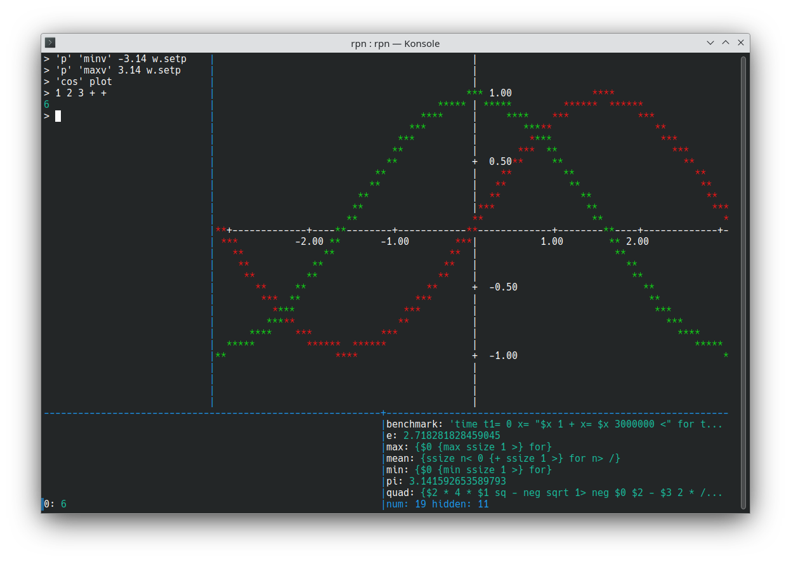
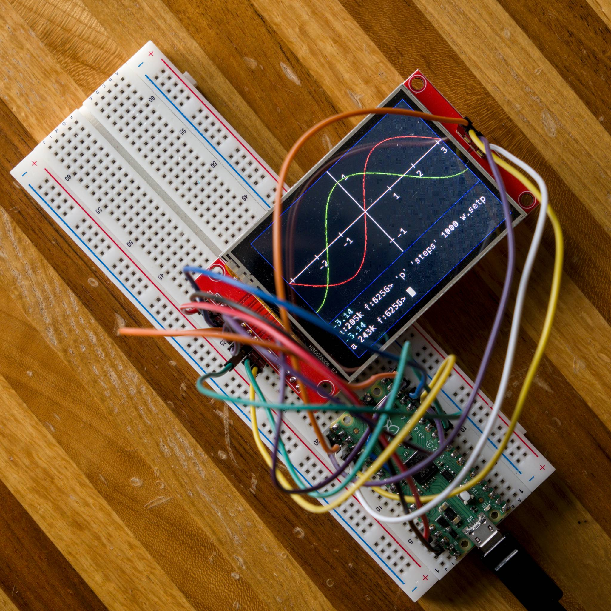
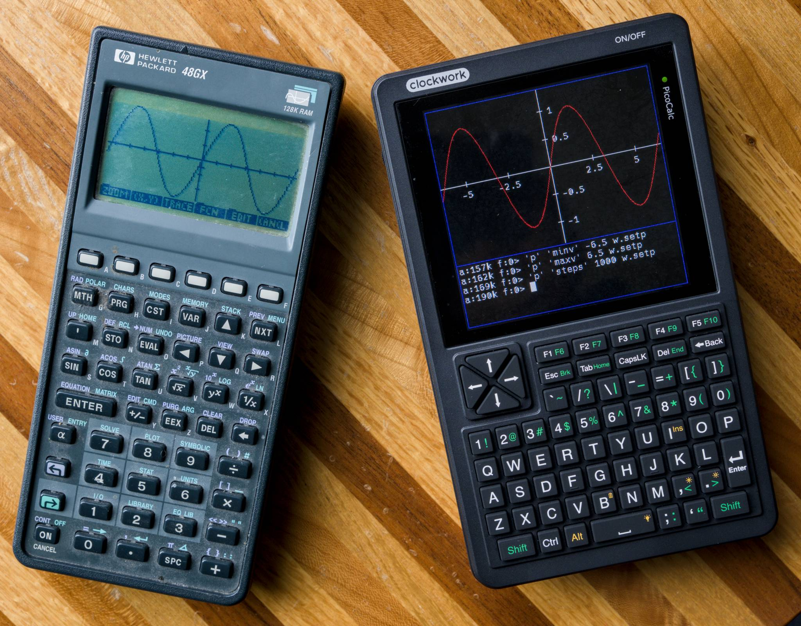

# RPNGO

This page is a summary.  See the full [User's Guide here](USER_GUIDE.md)

This project is implements a programmable RPN graphing calculator using golang
and TinyGO.

It can be run on regular PCs (including Raspberry Pi):

Or embedded microcontrollers.  Here it is running on a breadboard:

And a PicoCalc:

## Why

I've been writing code professionally and for fun for many decades in 20+
languages. Of those languages, my favorites are golang for PC utilities
and tools and C for microcontroller projects.  What about golang on microcontrollers?

I decided to give TinyGO a try and see. Later in this doc, I talk about my views
on TinyGO so far (TLDR: I think it's fun to use and great for experimental work
but is not yet ready for more serious efforts).

Why an RPN calculator? We'll I spent my early days on an HP-48G user and
wanted a modern calculator that worked in a similar-but-modernized way. I then
discovered the PicoCalc, an $80 platform for making your own retro computer /
calculator:

The calculator ships with Micro Basic, Python, LISP and an NES emulator -
plenty to experiment with right there! But I wanted to do something lower-level
and work directly with the hardware.

## Base Features (as of 11/2025):

A quick list of things the calculator can do:

- All regular and scientific calculator operations (e.g. `+`, `-`, `sqrt`, 'sin`, ...)
- Working with the following number formats: complex, integer, binary, octal, hexidecimal
- Bitwise and logical operations
- Working with string data
- Unit conversion (e.g. miles/hour -> meters/sec)
- 2D plotting (regular and parametric)
- Simple programming
- Variables
- Customisable window layouts
- Custmizable keyboard shortcuts
- Disk and serial IO (still experimental on TinyGO)
- Build in editor

## Non-implemented (as of 11/2025)

- Matrix algebra
- Symbolic equation support / features
- Wifi Support

# My TinyGO Impressions (10/2025)

Traditional Go on Rasperry Pi, PCs and servers is a mature product used
in production enviroments.  For example, Kubernetes and Docker are both
implemented in Go.

TinyGo, by contrast, is not currently ready for "serious" work (e.g. used in a
product for-sale) for the following reasons (with the cavet that, by the time
you read this, the situation may have been improved).

## Memory Management

Memory management issues form the biggest problem areas for TinyGo.  

### Implicit Allocation

Memory is usually a precious resource on a microcontroller,
with a couple hundred kilobytes considered a generous offering.
As a quick refresher, there are usually 4 types of directly accessible memory:

- *Read only*: Data and code stored in flash memory
- *Static*: Globally-defined structures
- *Stack*: Memory that holds small local variables for functions
- *Heap*: General purpose memory that can be used when the above choices don't work well.
  For example, say you are implementing an programmable RPN calculator
  and do not know what kind of programs the user will send your way `:)`

In classic C/C++, all 4 of these are explicitly user controlled.  In many
embedded applications heap memory can be avoided entirely.  In cases where it
is needed, the `malloc()` and `new` calls can return a null pointer if they
fail, giving the program more options than just crashing.

In Go, whether to use stack or heap memory is implicit and guided by heuristics
(e.g. if object is less than N bytes, use the stack otherwise the heap) and
escape analysis. Both of these can change over time as they are not guaranteed
to work a certain way.

In TinyGO, you can compile with `-show-allocs` to list the allocs that will
occur but, again, the report is not guaranteed to remain stable as new versions
of Go are released.  I see that it also lists many go standard library
functions in it's output.

### Heap Fragmentation

The current heap allocator in TinyGo will not move allocated memory.  This
means that, over time it's possible to have enough total free memory for an
allocation but fail anyway.

Fixing this would involve reworking how pointers are implemented (behind the
scenes).  It will also require a new framework be created for interrupts
handlers (to avoid the interrupt trying to access heap memory that can move).
It should be solvable, but will take work to get there.

### Panic behavior

Running out of memory thows a Panic.  TinyGO's current reaction to a panic
depends on what code throws it.  In the case of the memory allocator, it seems
to be some other task that throws the panic and the result is a message
written to the serial port followed by a processor hang even if a panic handler
was registered.  This is ok during early development but not good behavior for
a shipping product.  A better solution is needed.

### Refinement and Polish

While I was working on TinyGO: I saw many signs of a not-quite mature product:

- Using the default compile flag `--sceduler=cores` caused hangs when garbage
collection is run.  Switching to the previous `--scheduler=tasks` fixes it
but only runs on one core.
- Performance is surprisingly worse on Pico2 than Pico for my project and I don't
have tooling to assist digging into it further (e.g. profiling tools)
- TinyFS is unstable with FAT filesystems

I'l end by saying that it's amazing that it works as well as it does and it's
by no means trivial to implement something like TinyGo. But regardless of
difficulty, the classic c/c++ tooling avoids problems like those stated above.
The current Rust toolchain may also (I have not investigated that enough to say).

