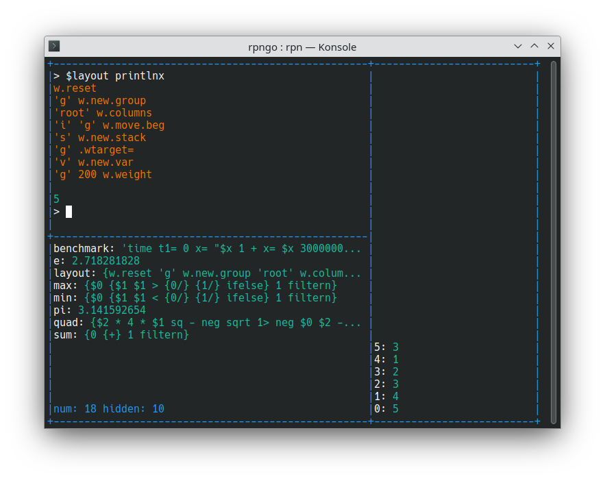

# RPNGO USERS GUIDE

## Build

You'll first need to [install golang](https://go.dev/doc/install).

There is a `bin/` directory that contains various different configurations of `rpngo` for
PCs and for microcontrollers. Here is an overview:

- `bin/minimal/rpn` - The most basic version.  Parses `args` and exits.
- `bin/ncurses/rpn` - Uses [`ncurses`](https://en.wikipedia.org/wiki/Ncurses) to
  support multiple view windows and even text-based plotting
- `bin/tinygo/serialonly` - A minimal build for  microcontrollers that uses
  serial communication only.
- `bin/tinygo/ili9341` - A full-featured TinyGo microcontroller build that uses
   USB serial for input, and a ili9341 color LCD for output.
- `bin/tinygo/picocalc` - A full-featured TinyGo microcontroller build that
   targets a [PicoCalc](https://www.clockworkpi.com/picocalc).


### Desktop / Raspberry Pi

Minimal version:

```
cd bin/minimal/rpn
go build
./rpn 2 3 +
```

ncurses version 

You need have `libncurses-dev` installed.  In Ubuntu/Debian, the command is:

```
sudo apt install libncurses-dev
```

then

```
cd bin/ncurses/rpn
go build
./rpn
```

### Microcontrollers using TinyGo (Raspberry Pi Pico and Pico2 tested as working)

You'll need to [install TinyGo](https://tinygo.org/getting-started/install/).

Minimal. Tested on Pico and Pico2.  Other chips may need some configuration
changes. Chipe with low resources (like atmega328p) probably won't work:

```
cd bin/tinygo/serialonly
tinygo build -target=pico
```

ili9341 LCD, using serial for communication

```
cd bin/tinygo/ili9341
# check the command
make -n flash
# if looks ok, execute
make flash
```

PicoCalc

The default assumed you have a rp2350 (Pico2) installed.
You can change the target in `Makefile` to `pico` if you have
an original Pico installed instead.

```
cd bin/tinygo/picocalc
# check the command
make -n flash
# if looks ok, execute
make flash
```


### Build Everything and Run Unit Tests

When changing the code, it's good to run unit tests and assert that everything
can still compile without errors. In the top-level directory, you can type

```
make all
```


## RPN Introduction

This "users guide" will take the format of being mostly working examples.
Let's start with the basics.

RPN is an old and proven way to do calculations that is popular in engineering
fields.  Much has been written on the subject. You can [read more here](
https://en.wikipedia.org/wiki/Reverse_Polish_notation)

Let's start with '2 + 3'


    2
    3
    +

or

    2 3 +

Both forms (spaces and new lines) do the following:

1. Push a `2` to a "stack"
2. Push a `3` to the same stack
3. Call the `+` operator which pulls 2 stack values (`2`, `3`) and pushes the result `5`

You can use the up arrow to browse command history. Command history might make
the `2 3 +` style more convenient than using separate lines.

There are some technical reasons I could use to argue for RPN (no parenthesis
needed, etc) but my main personal reason is that I saw my test scores in
college jump after switching because I made fewer mistakes than with my
previous calculator.  I carry that positive feeling with me to this day and
simply enjoy using them now.

## Base Features

    2 4 +            # 6
    2 4 -            # -2
    2 4 *            # 8
    2 4 /            # 0.5
    4 sq             # 16
    4 sqrt           # 2
    -1 sqrt          # i
    4+i 5-2i +       # 9-i
    2 4 min          # 2
    2 4 max          # 4
    4 neg            # -4
    -4 abs           # 4
    3.14159 3 round  # 3.142

## Scientific

    2 4 **    # 16
    3.14 sin  # 0.001592652916
    3.14 cos  # -0.9999987317
    3.14 tan  # -0.001592654936
    5 log     # 1.609437912
    10 log10  # 1

### User Interface

The experience is similar to most terminals:

- Left, right, insert, backspace, home, and end all work like you would expect
- Press up and down arrows to scroll through command history
- Ctrl-C to cancel a running program
- Ctrl-D to exit the program
- Press "ESC" or "page up" to enter scrolling mode where you can
  use page up, page down, up arrow and down arrow to view text
  that has scrolled off the top of the window. "ESC" or scrolling
  down far enough exits this mode.

Type `edit` to enter a full-panel multi-line editor.  The window
will contain the value at the top of the stack.  For example:

```
'animate_sin.rpn' load edit
```

The editor is currently only supports basic features:

- arrow key, page up, page down, home, end navigation
- insert, replace, backspace, delete
- syntax highlighting

While editing, press "ESC" to keep your changes (which will be
at the top of the stack) or "Ctrl-c" to exit without changing the
value.  If you happen to want to save your work permanently, exit with
"ESC", then type something like:

```
'my_file.txt' save
```

If you need more editing power, you can use a text editor on
your computer and copy over the file via serial or
an SD Card.

### Stack Shifts

You can move values around the stack.

    10 20 30   # put 10 20 30 on th stack
    1>         # now the stack is 10 30 20
    1<         # back to 10 20 30
    2>         # now the stack is 20 30 10
    2<         # back to 10 20 30
    $2 2<      # now it's 10 10 20 30

### Stack Deletions

    10 20 30         # put 10 20 30 on the stack
    1/               # now the stack is 10 30
    0/               # now the stack is 10
    d                # emptys all values from the stack
    10 20 30 2 del   # delete 2 values from the stack (leaving 10)
    10 20 30 2 keep  # keep 2 values from the stack (leaving 20 30)


### Using Variables

You can define and use variables.  Most build variants will define some
variables, such as `$pi`, on startup.

    5 a=
    2 $a +  # 7

Variables that start with a `.` are hidden by default in the variable window
(which we'll get to later). These often are used for special configuration
settings.

There are also special variables, `$0`, `$1`, etc, which represent values on
stack. `$0` represents the value at the top of the stack. If the stack
is empty, then using `$0` results in an error.  e.g.

    5 sq    # squares the number 5
    5 $0 *  # also squares the number 5

### Variables Can Be Stacks

Variables can hold more than one value.  This was created for two
purposes:

1. Snapshot the whole stack so you can easily do whole-stack operations
   (such as sum, min, max, etc) on the same set of data
2. Push individual variables within functions to preserve their original
   value when the function exits.

Here is the demo:

```
   # push 5 to the variable x
   5 x<  # x is now [5]

   # push 4 to x
   4 x<  # x is now [5, 4]

   # What if we use $x now?
   $x    # well get 4

   # What about this
   $$x   # 4, then 5 will be pushed to the stack

   # Pop an X value
   x>    # 4 is pushed to the stack, x is now [5]

   # Pop another one
   x>    # 5 is pushed to the stack, x no longer exsits

   # Push the whole stack to x
   d 1 2 3 x<<  # x will be [1, 2, 3]

   # Pop the whole x (similar to $$x, but removes x)
   x>>  # 1, 2, 3 on the stack, x no longer exists

   # What about this
   d 1 2 3 x<< x/  # x is deleted, use x> to only pop one value
```

Note that using variables as stacks can create memory pressure on microcontrollers
if it's pushed too far.


### Number Bases

Many type of numbers are supported

    50       # floating point (actually a 5+0i complex)
    50+i     # complex number
    50d      # Integer
    32x      # Hexidecimal
    62o      # octal
    110010b  # binary

Most operations can us a mix of these types, using the following rules:

    # Any number type mixed with float results in a float
    12.4 5d +  ->  17.4

    # Two integer types combined takes the base of the left term
    32x 50d +  ->  64x

You can also convert between types using `hex`, `bin`, `oct`, `float`, `real`,
`imag`, and `str`. You can convert from a string to a type by executing
it with `@`

    "54x" @  ->  54x

### Booleans and Conditionals

Boolean values include `true` and `false`.  Conditionals return a boolean:

    true       #  true
    false      #  false
    1 2 >      #  false
    1 2 <      #  true
    1 2 =      #  false
    1 2 !=     #  true
    1 2 >=     #  false
    1 2 <=     #  false
    false neg  #  true
    true neg   #  false

You can also compare different types, which is in support of `sort` and
`sortn`:

    true 1 <       # true: booleans are always less than numbers
    1 "foo" <      # true: numbers are always less than strings
    "bar" "foo" <  # true
    1 1d =         # true: you can compare floats and integers
    1 1+i =        # false
    1+i 2 <        # true: This is mathmatically wrong (can't really compare complex)
                   #       but we need it for programming. < only
                   #       compares real parts and ignores complex parts

The final rule may be changed in the future (to an error), if a compelling
usecase can be presented.

Conditionals are an essential part of programming, which we will cover
with examples later.

### Strings

There are three ways to specify a string

    "hello world"
    'hello world'
    {hello world}

All three examples define the same string.  The third form can be useful
when you want to nest terms in a program.

    {0 x= {$x 1 + x= $x println 1000 <} for} count=

It could also be done with other string types, rpngo will execute them
the same way:

    '0 x= "$x 1 + x= $x println 1000 <" for' count=

Which do you find easier to read?

### Macros

You can define a string as a macro, here is one for the area of a circle (`$pi
* r * r / 2`), given the radius:

    {sq $pi * 2 /} carea=
    5 @carea -> 39.26990817

Macros are a building block in programming, a deeper topic that is covered
later.

### Labels

Labels can be added to non string values.  A label shows up in the stack window
and can be used to annotate what the number represents.  This can be
useful when attempting to do complex calculations purely using the stack.
It cal also be used to communicate what values are (The `heapstats` function
uses this)

For example, say you want to make a formula that converts velocity, time, 
and acceleration into distance. The formula is `(v * t) + (0.5 * a * t * t)`.
You could use variables or the pure stack. If you use the pure stack, labels
can help keep track of what is what:

     1 `v
     2 `a
     3 `t

Now the stack will look like this:

     2: 1 `v
     1: 2 `a
     0: 3 `t

You can see that `$1` is `a` and see how `a` changes stack slots as you
work the equation.  This makes it easier to create a macro that does
not define any variables (which can be fun little puzzles to solve).

    {$0 sq 2> * 2 / 2< * +} dist=
    1 2 3 @dist  ->  12
   
### Unit Conversions

You can convert between several unit types, some examples:

    5 km>mi
    3.106855961

    60 mi/h>m/s
    26.8224

    10 liter>m*m*m
    0.01

    1 megabyte>bits
    8388608

See all possible conversions with

    conversions?


## Window Layout

The `rpngo` program supports several window types:

- Input
- Stack
- Variables
- Plot

Of the above, only the input is required.  For the others,
you can have zero or more of them.  For example, if you
want an input window and two separate plot windows, you
can do it. You might also have two stack windows with
different configuration options set.  Whatever you want.

These options need a means to create windows and put
them in the position and size you want.

For example, say we want the following:

```
+------------------+---------------+
|                  |               |
|                  |               |
|                  |               |
|   Input (i)      |  STACK (s)    |
|                  |               |
|                  |               |
+------------------+               |
|                  |               |
|                  |               |
|   Vars (v)       |               |
|                  |               |
|                  |               |
+------------------+---------------+
```

How do we do it?

The `rpngo` window system works a bit like html tables. You have a 'root'
window (like a table) that can either contain `1xn` or `nx1` children.
Each child can either be a window (input, stack, etc) or a window
group with the same rules as the root group.

Let get on with how you would create the layout above.  First, lets reset
everything:

    w.reset

You'll have this default starting point:

```
+----------------------------------+
|                                  |
|                                  |
|                                  |
|                                  |
|                                  |
|                                  |
|         Input (i)                |
|                                  |
|                                  |
|                                  |
|                                  |
|                                  |
+----------------------------------+
```

Now lets add a window group names g

    'g' w.new.group 

and we'll have

```
+----------------------------------+
|                                  |
|                                  |
|         Input (i)                |
|                                  |
|                                  |
|                                  |
+----------------------------------+
|                                  |
|                                  |
|         Group (g)                |
|                                  |
|                                  |
+----------------------------------+
```

Let's switch the root window to column layout

    'root' w.columns

```
+----------------+------------------+
|                |                  |
|                |                  |
|                |                  |
|                |                  |
|                |                  |
|                |                  |
|   Input (i)    |    Group (g)     |
|                |                  |
|                |                  |
|                |                  |
|                |                  |
|                |                  |
+----------------+------------------+
```

and move input into the group

    'i' 'g' w.move.beg

```
+----------------------------------+
|                                  |
|                                  |
|                                  |
|                                  |
|                                  |
|                                  |
|         Input (i)                |
|         Group (g)                |
|                                  |
|                                  |
|                                  |
|                                  |
+----------------------------------+
```

Let's add the stack window:

    's' w.new.stack

```
+----------------+------------------+
|                |                  |
|                |                  |
|                |                  |
|                |                  |
|                |                  |
|                |                  |
|   Input (i)    |    Stack (s)     |
|   Group (g)    |                  |
|                |                  |
|                |                  |
|                |                  |
|                |                  |
|                |                  |
+----------------+------------------+
```

and finally the vars window. We have two options here. We can either add the vars
window to the root window, then move it to `g` or create it in `g` to begin with.
If we just say:

    $.warget

It will say

    'root'

We can change this "special" variable to alter the behavior of `w.new.*` commands.
Note there is also `w.beg` and `w.weight` for controlling placement and size.
Let's not worry about that yet:

    'g' .warget=
    'v' w.new.var

and we are done

```
+------------------+---------------+
|                  |               |
|                  |               |
|                  |               |
|   Input (i)      |  STACK (s)    |
|                  |               |
|                  |               |
+------------------+               |
|                  |               |
|                  |               |
|   Vars (v)       |               |
|                  |               |
|                  |               |
+------------------+---------------+
```

OK, one more things.  Say we want to change some sizes above.
Window and group "weights" are used to do this. Each window and group
above is assigned a default weight of 100.  Weights are shared
amongst siblings in a group to decide how much space each one gets.

For example, ley's change the weight of window group 'g' from 100
to 200.

    'g' 200 w.weight

Things will shift as so:

```
+----------------------+-----------+
|                      |           |
|                      |           |
|                      |           |
|   Input (i)          | STACK (s) |
|                      |           |
|                      |           |
+----------------------+           |
|                      |           |
|                      |           |
|   Vars (v)           |           |
|                      |           |
|                      |           |
+----------------------+-----------+
```

A "real example":



There is a command, `w.dump` that will output the current layout for
inspection. Let's try it:

    w.dump

    root(x=0, y=0, w=80, h=30, cols=true, weight=100):
      g(x=0, y=0, w=53, h=30, cols=false, weight=200):
        i(type=input, x=1, y=1, w=51, h=13, weight=100)
        v(type=var, x=1, y=15, w=51, h=14, weight=100)
      s(type=stack, x=53, y=1, w=26, h=28, weight=100)

    .wtarget=g .wend=true .wweight=100d
 
We might want to set `$.wtarget` back (or push/pop it with `.wtarget<` and `.wtarget>`,
but note that `w.reset` also sets `$.wtarget` back to `root` and most window
management macros start with `w.reset` anyway.

## Programmable Function Keys

Configuring windows like above is flexible but cumbersome.  For everyday use,
there are variables like `.f1`, `.f2` that invoke when you
press the corresponding F key.  I like to set these to change window
layouts.  For example:

```
# Input and stack window
{
  w.reset
  's' w.new.stack
  's' 30 w.weight
} .f1=

# Just one big input window
{w.reset} .f2=
```

and so on.

## Window Properties

Each of the four window types (input, stack, variable, plot) have customizable
properties.  We'll start with common commands, then explore details (expect
for plot, which we cover later).

### Input Window Properties

You can list properties for a window with `w.listp`

    'i' w.listp

       autofn: {}
       showframes: 1d

These are what the input properties do:

- `autofn` Executes the given code before showing a prompt.  This can be used to
  track memory usage, print a custom message, update a graph, or anything you want.
- `histpath` Te path to load history from and save it to.  This is `$HOME/.rpngo_history`
  by default. Changing th path can be usedful when combined with `histl` and `hists`.
- `showframes` How much of the stack to copy to the input window after each
  entered command. More or less stack in the history has it's trade-offs and is
  personal preference.

Here is an example of setting properties:

    0 cmd=
    'i' 'autofn' {$cmd 1 + print cmd=} w.setp

Now w have an `autocmd` property set in the input window that will print an
incrementing command number every time you press enter.  Only one more
property command to cover:

    'i' 'autofn' w.getp

This copies the property value to the stack. It can be useful if you
want to use a property value in a program.

### Stack Window Properties

    's' w.listp

      round: -1d

For now, the only property is `round` which allow you to round
floating point numbers to a given number of decimal places (-1
represents no rounding).

### Variable Window Properties

    'v' w.listp

      showdot: false
      multiline: false

- `showdot`: If true, then variable names that start with a `.` (such as
  `.wtarget`) will also be shown.
- `multiline`: If true, then string that expand multiple lines will
  show all of these lines in the window (assuming there is space).

## Plotting

Let's plot `x * x`:

    'sq' plot

We'll see this in ncurses:


And this on an LCD display:


This is how `plot` works.

- It pushes a range of values to the stack (from `minv` to `maxv` with `steps`
  divisions)
- After pushing a value, it calls the argument to `plot`. In the example above
  that would be `sq` or "square the value"
- The result of this calculation is used as the `y` coordinate.

Let's add a second plot:

    'sin' plot


It doesn't yet look like a sine wave because the x range is currently
-1.0 to 1.0.  Let's check properties.

### Plot Properties

    'p' w.listp

      autox: true
      autoy: true
      color0: 0d
      color1: 1d
      fn0: {sq}
      fn1: {sin}
      maxv: 1
      maxx: 0.992
      maxy: 1.368294197
      minv: -1
      minx: -1
      miny: -1.209765182
      numplots: 2d
      parametric0: false
      parametric1: false
      steps: 250d

There are quite a few properties because there is quite a bit that can be
done with plots.  Let's start by updating the x range.  You might think
`minx` and `maxx` here but these are for the window and not the plot
points.  Currently we have `autox` and `autoy` set to `true` so
`minx`, `maxx`, `miny` and `maxy` will be handled automatically. To
get what we want, we adjust `minv` and `maxv`

    'p' 'minv' -3.14 w.setp
    'p' 'maxv' 3.14 w.setp


Still not great because the `x * x` plot has a range that is crushing the
range of sin. This can be addressed by setting `miny` and `maxy` manually
instead of relying on `autoy`:

    'p' 'miny' -1.1 w.setp
    'p' 'maxy' 2 w.setp


Looking better now.  To end the demo, we'll add a parametric plot
of a circle.  For parametric plots, we don't just leave `y` on the
stack but instead leave both `x` and `y`.  Lets draw a circle,
who's parametric equation is `x = cos t, y = sin y`:

  '$0 cos 1> sin' pplot


and on an LCD build:


Let's see how properties changed:

    'p' w.listp

      autox: true
      autoy: false
      color0: 0d
      color1: 1d
      color2: 2d
      fn0: {sq}
      fn1: {sin}
      fn2: {$0 cos 1> sin}
      maxv: 3.14
      maxx: 3.14
      maxy: 2
      minv: -3.14
      minx: -3.14
      miny: -1.1
      numplots: 3d
      parametric0: false
      parametric1: false
      parametric2: true
      steps: 250d

Now we can look at each property. All can be changed with `w.setp`:

- `autox`: If true, the x limits of the plot window are handled automatically
- `autoy`: Just like `autox` by for the vertical range
- `color*`: The color index of each plot. If you want to make plots a specific
  color, you can set these
- `fn*`: Plot functions. You can set these to change the plotted function. You
  can set to an empty string to nullify a plot.
- `minv`, `maxv`, `steps`: Determines the range of points that will be sent to the
  plot.
- `minx`, `miny`, `maxx`, `maxy`: The area the plot window covers.  If these are
  set, the corresponding `autox` or `autoy` will be set to `false` (and can be reset
  to `true` later if you want).
- `numplots`: Indicates how many plots there are. This can be set to change the
  number of plots.  Decreasing it will remove the higher-indexed plots.  Increasing
  it will create null-valued plots that can be configured with additional `w.setp` calls.
- `parameteric*`: Determines if the plot is parametric (needs to push x and y) or not
  (just needs to push y)

Now that we covered all of the properties, it can be revealed that `plot` and `pplot`
are simply setting these properties "behind the scenes". You can do so manually,
if you want.  Here, we plot `sin` and `cos` using the low-level `w.setp` method:

    # manually create a window
    w.reset
    false .wend=
    'p' w.new.plot
    'p' 300 w.weight

    # make the plot
    'p' 'numplots' 1 w.setp
    'p' 'fn0' 'sin' w.setp
    'p' 'minv' 0 w.setp
    'p' 'maxv' 20 w.setp


### Special Plot Variables

- `$.plotwin` The name of the plot window, usually set to `p`
- `$.plotinit` A macro that `plot` and `pplot` will execute if there
  is no `$.plotwin` window present. It is expected that one will
  exist after `@.plotinit` is executed. This is a variable to allow
  you to control the automated plot creation process.
- `$.t0` This variable is set to `true` when the very first plot point
  is calculated and `false` otherwise. Some plot functions, especially
  those that use variables, might need this information.


## File Operations

> File operations work well on PC platforms are are still experimental in TinyGO due to
the current (10/2025) instability of the `tinyfs` library. You can use file operations
in TinyGO, but don't use an SD card with critical data on it and be ready for the
calculator to start returning errors on file operations (or even hanging) while
executing the commands.

### Shell commands

Use the `sh` command to perform shell operations:

    'ls' sh


On PCs, you can call any shell command. In TinyGo, only a small set of commands
('ls', 'rm', 'pwd') has been implemented.

There are also special variables that can be set to support
various shell usecases:

    # Set $.stdin to pass data to a process stdin
    'apple\npear\norange\ngrape' .stdin=
    'sort' sh

      apple
      grape
      orange
      pear

    # Push the command output to the stack (.stdin is still set)
    true .stdout=
    'sort' sh fields  # the stack will contain ['apple', 'grape', 'orange', 'pear']
    

### Load, Save, Execute

    'foo' cd  # change directory to foo

    'animate_sin.rpn' load @  # load a program and execute it
    'animate_sin.rpn' source  # same thing
    'animate_sin.rpn' .       # same thing

    'hello world' 'hello.txt' save  # save "hello world" to a file

### XMODEM send and receive

What is old is new.  It's possible to send and receive data from rpngo on
microcontrollers using the XMODEM protocol.  XMODEM was chosen because the
PicoCalc UART via TinyGo loses bytes now and then and XMODEM is the least
complicated well-supported way to get around that problem.

## Send a file to RPNGO

You can, in theory, use any PC program that supports XMODEM-CRC (128 byte
packets, 16-bit CRC).  I actually tested it with `screen` and `sx`.  First,
installation:

    sudo apt install screen lrzsz

Then start screen with the following option:

    screen /dev/ttyACM0 115200

I'm assuming the serial device on my PC and yours will be the same, which could
be incorrect.  I'm also assuming you want to send a file named `bounce_ball.rpn`;
change the name to the file you actually want to send.

Next type `Ctrl-A`, `:` and type this at the prompt:

    exec !! xc bounce_ball.rpn

and on the calculator:

    xmodemr

If everyting worked, you will have the contents of the file as a string
at the top of the stack.

## Programming

RPNGO provides support for simple programming. It's not going to replace
your favorite programming language for general work, but will allow
you to customize the calculator and mold it's functionality to meet
your usecase.

First, the building blocks:

## Conditionals

`if` and `ifelse` can be used to conditionally execute a bit of code
based on the result of a `true`/`false` condition.

```
> true {'yes' printlnx} if
yes

> false {'yes' printlnx} if

> 5 1 > {'is greater' printlnx} if
is greater

> true {'yes'} {'no'} ifelse printlnx
yes

> false {'yes'} {'no'} ifelse printlnx
no
```

## For Loop

You can use the `for` command to loop until a condition returns false.
Let's start with some impractical examples:

    {false} for  # exits immediately
    {true} for   # loops until you press ctrl-c to break

Now for something more interesting, how about counting to 1000?

    0 x= {$x 1 + println x= $x 1000 <} for

Note that it's the last three statements (`$x 1000 <`) that
is creating the `true` / `false` boolean that `for` uses
to decide when to end.

A simple tweak let's us load up the stack with numbers.

    0 x= {$x $x 1 + x= $x 100 <} for 

## Filtering

Filtering is a convenience command that allows some kind of for
loops to be written with less code - particularity ones that work
with multiple stack values.

As an example, say you want to multiply every value on the stack by 2.
A for loop can be used:

    {{2 * vals< ssize 0 >} for vals>> reverse} double=
    1 2 3 @double  # results in 2 4 6 on the stack

We can also use `filter`, which manages some of the work for us

    {{2 *} filter} double=

The `filter` command does this:

1. Takes each value on the stack
2. Copies to it the top
3. Calls it's argument.
4. Removes the original values

In addition to transforming every value, the `filter` command can filter values:

    {$0 50 >= {0/} if} filter  # remove numbers >= 50

Note that `del`, `keep` and variable pushes (e.g. `x<<`, 'x>>`) can be combined
to filter a subset of values:

    {
      st== $$st            # snapshot stack
      5 keep {2 *} filter  # filter 5 values
      doubled<<            # store those
      st>> 5 del           # restore stack, remove 5 values
      doubled>>            # sub in doubled values
    } double5=

This can be applied to other functions (`sort`, `reverse`, etc) as well and
has endless possible tweaks (for example, use a variable instead of a
hard-coded 5)

## Sorting

The sort command will sort every value on the stack

    2 10 5 6 3 sort  # 2 3 5 6 10

Note that, when you sort different types, the convention-based comparison rules
are followed (strings > numbers > boolean):

    5d 10 4d 3 'foo' 'bar' true false sort  # false true 3 4d 5d 10 'bar' 'foo'

## Reverse

Reverse a stack with `reverse`

    1 2 3 4 reverse  # is now 4 3 2 1


### Other Programming Notes

Some of this is covered in other sections of the guide, but it's here
to make you aware in case you have not read it all.

- `@`: Executes the head element (usually a string).  e.g. `{2 2 +} @`.
  Note that `$foo @` has the same result as `@foo`.
- `print`, `println`, `printx`, `printlnx`:  Prints the head of the stack
  The `x` versions also remove the stack element.
- `prints`, `prints`: Prints with a space after
- `load`, `save`: Loads and saves values to disk
- `.`, `source`: The same as `load @`.
- `noop`: Does nothing. This is sometimes useful as a placeholder.
- `delay`: Delays for the given number of seconds (which can be a floating
  point number like `0.1`). Delays are useful when animating graphs.
- `time`: Prints a relative time in floating point seconds. This is useful
  when benchmarking (take a `t0`, do your operation, then do `time $t0 -`).
- `edit`: A simple editor for multiline strings.
- `rand`: Create a random value from 0 to 1
- `input`: Waits for the user to enter input, pushes it to the stack as a
  string.

## Example Programs

### Number Guess

```
{
  rand 101 * int a=  # set a to a random number
  $guess_fn for     # loop until the user guesses correctly
  {
    "enter a number from 0-100: " printx input int g=
    # The next 3 lines put one message on the stack
    $g $a < {"too low"} if
    $g $a > {"too high"} if
    $g $a = {"correct!"} if
    printlnx # print the message
    $g $a != # loop conditional
  } for
} number_guess=
```

Run it with

    @number_guess

- First we come up with a random number from 0-100 and store
  it in `a`.  Don't worry about the user seeing the number
  because the variable window will not update until the program
  has finished (as we are not calling `'v' w.update` anywhere).
- Next is a loop which asks the user for a guess, then uses three
  `if` statements to feedback a message.  Finally, a check
  to see if the `for` loop should exit.

### Animated Plot

Here is an example that will animate a `sin` wave:

```
# create a plot of sin and animates it running though
# various phases
{
  0 t=                     # initial phase
  {$t + sin} plot          # plot it
  'p' 'minv' -3.14 w.setp  # set graph limits so they don't change while animating
  'p' 'maxv' 3.14 w.setp
  'p' 'miny' -1.1 w.setp
  'p' 'maxy' 1.1 w.setp
  {
    'p' w.update  # redraw plot
    $t 0.1 + t=   # next phase offset
    0.015 delay   # wait a little bit (~60 FPS)
    $t 30 <       # Check for end of program
  } for
} animate_sin=
```

Run it with `@animate_sin`

Most of it should be familiar.  Here are the new bits:

```
0 t=
{$t + sin} plot
```

Here we are using a `$t` variable to change the phase of the sin wave.

    'p' w.update

Just changing `$t` does not necessarily update the plot window, the
`w.update` command ensures that it happens.

    0.015 delay

On a PC, the script above will complete in a fraction of a second unless
we slow down the loop with a delay (here we delay for 15ms per frame).

### Bouncing Ball

Understand "Animated Plot" before going here.

```
{rand 0.5 - 0.02 *} randvel=
{
  @randvel xv=
  @randvel yv=
  0d i=
  0 x=
  0 y=
  0.05 diameter=
  {$0 cos $diameter * $x + 1> sin $diameter * $y +} pplot
  'p' 'minv' 0 w.setp
  'p' 'maxv' $pi 2 * w.setp
  'p' 'minx' -1 w.setp
  'p' 'maxx' 1 w.setp
  'p' 'miny' -1 w.setp
  'p' 'maxy' 1 w.setp
  'p' 'steps' 30 w.setp
  {@next_frame $i 1 + i= $i 1000 <} for
  'p' w.del
} bounce_ball=

{
  $x $xv +
  $0 abs 1 > {$xv neg xv= $xv + x=} {x=} ifelse

  $y $yv +
  $0 abs 1 > {$yv neg yv= $yv + y=} {y=} ifelse

  'p' w.update
  1 60 / delay
} next_frame=
```

Three functions:

- `randvel`: Creates a random velocity from -0.02 to 0.02.
- `bounce_ball`: Similar to the animated sin example, but draws a ball at
  `$x`, `$y`
- `next_frame`: A helper that updates `$x` and `$y` and handles bouncing off
  the edges of the graph areas.

### Numerical Derivative Plot (dy/dx):

```
{
  'p' 'maxv' w.getp 'p' 'minv' w.getp - 'p' 'steps' w.getp / dx=
  'p' 'minv' w.getp $dx - @dydx.fn yprev=
} init=

{
  dydx.fn=
  {
    $.t0 $init if
    @dydx.fn
    $0 $yprev -
    1> yprev=
    $dx /
  } plot
} dydx=
```

Try it with

    'sq' plot
    'sq' @dydx


- Snapshot the argument into `$dydx.fn` so we can call it multiple
  times later.
- Calculate `dx` by looking at plot limits and steps.
- An initial `yprev` needs to be calculated to allow the first point
  to be calculated
- The plot function looks at `$t0` which is true when the first plot
  is presented (this is a feature of the calculator). It needs this
  information to calcuate `dx` and the initial `yprev` above.
- Execute `@dydx.fn` to get the value.
- Use `$yprev` to calculate `dy` and divide by `$dx`. That's our plot point.

### A Set of Statistics

```
    {0 {+ ssize 1 >} for `sum} sum=

    {ssize n< @sum n> / `mean} mean=

    {
      ssize sn<
      svals==
      $$svals @mean smean<
      svals>> {$smean - sq} filter
      @sum
      sn> / sqrt
      `stddev
      smean/
    } stddev=

    {$0 {min ssize 1 >} for `min} min=

    {$0 {max ssize 1 >} for `max} max=

    {
      int p<
      sort reverse
      ssize $p * 100d / float '>' + @
      1 keep
      "`" p> float 'th-percent' + + @
    } percent=

    {50 @percent `median} median=

    {
      vals==
      $$vals @sum statv<
      $$vals @min statv<
      $$vals @max statv<
      $$vals 10 @percent statv<
      $$vals @median statv<
      $$vals 90 @percent statv<
      $$vals @mean statv<
      $$vals @stddev statv<
      vals>>
      statv>>
    } stats=
```

There are a number of different functions above that separately calculate
`sum`, `min`, `max`, `mean`, `stddev`, `10th percentile`, `median`, `90th percentile`,
and finally one wrap-up function called `stats` that calculates all of the above
on a given set of numbers.  Try to understand them individually.
