# RPNGO USERS GUIDE

This document walks through various features of the RPNGO RPN calculator. I
mostly explain in terms of examples that you can try yourself.

## Building RPNGO

You'll first need to [install golang](https://go.dev/doc/install).

There is a `bin/` directory that contains various different configurations of
`rpngo` for PCs and for microcontrollers. Here is an overview:

- `bin/minimal/rpn` - A minimal PC (or Raspberry Pi)  version.  Parses `args` and exits.
- `bin/ncurses/rpn` - Uses [`ncurses`](https://en.wikipedia.org/wiki/Ncurses) to
  support multiple view windows and even text-based plotting
- `bin/tinygo/serialonly` - A minimal TinyGo build for  microcontrollers that uses
  serial communication only.
- `bin/tinygo/ili9341` - A full-featured TinyGo microcontroller build that uses
   USB serial for input, and a ili9341 color LCD for output.
- `bin/tinygo/picocalc` - A full-featured TinyGo microcontroller build that
   targets a [PicoCalc](https://www.clockworkpi.com/picocalc).


### Desktop / Raspberry Pi

Minimal version:

```
cd bin/minimal/rpn
go build
./rpn 2 3 +
```

ncurses version 

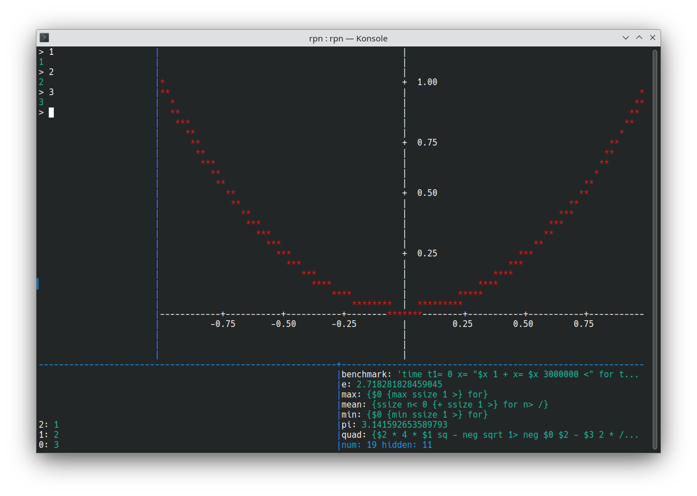

You need have `libncurses-dev` installed.  In Ubuntu/Debian, the command is:

```
sudo apt install libncurses-dev
```

then

```
cd bin/ncurses/rpn
go build
./rpn
```


### Microcontrollers using TinyGo (Raspberry Pi Pico and Pico2 tested as working)

You'll need to [install TinyGo](https://tinygo.org/getting-started/install/).

Minimal. Tested on Pico and Pico2.  Other chips may need some configuration
changes. Chips with low resources (like Atmega328p) likely won't work:

```
cd bin/tinygo/serialonly
tinygo build -target=pico
```

ili9341 LCD, using serial for communication

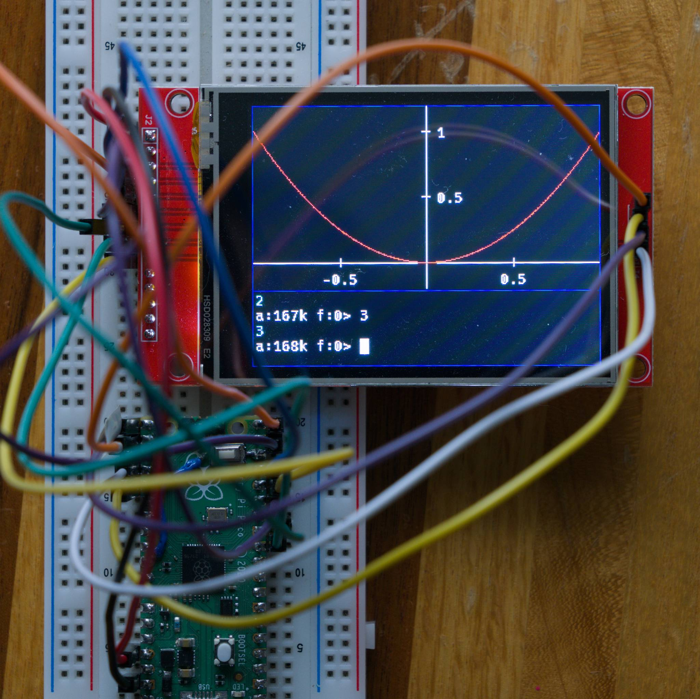

```
cd bin/tinygo/ili9341
# build for pico with internal littlefs
make build
# build for pico with sdcard fatfs (unstable/experimental)
FS=fatfs BLOCKEV=sdflash make build
# build for pico2 with littlefs
TARGET=pico2 make build
# build for pico2 with sdcard fatfs
TARGET=pico2 BLOCKDEV=sdflash FS=fatfs make build
# flash instead of build (applies to all examples above)
make flash
```

PicoCalc


```
cd bin/tinygo/picocalc
# All of the build/flash options are the same as ili9341 above
make build
```

#### littlefs or fatfs?

According to the [tinyfs library page](https://github.com/tinygo-org/tinyfs)
`littlefs` is more stable. On the other
hand `fatfs` is convenient in that your PC can read and write that format
with little trouble.  I tried both and found that `fatfs` initially works, but
starts throwing errors after a few commands.

### Build Everything and Run Unit Tests

When changing the code, it's good to run unit tests and assert that everything
can still compile without errors. In the top-level directory, you can type

```
make all
```


## RPN Introduction

RPN is an old and proven way to do calculations that is popular in engineering
fields.  Much has been written on the subject. You can [read more here](
https://en.wikipedia.org/wiki/Reverse_Polish_notation)

Let's start with '2 + 3'


    2
    3
    +

or

    2 3 +

Both forms (spaces and new lines) do the following:

1. Push a `2` to a "stack"
2. Push a `3` to the same stack
3. Call the `+` operator which pulls 2 stack values (`2`, `3`) and pushes the result `5`

You can use the up arrow to browse command history. Command history might make
the `2 3 +` style more convenient than using separate lines.

There are some technical reasons I could use to argue for RPN (no parenthesis
needed, etc) but my main personal reason is that I saw my test scores in
college jump after switching because I made fewer mistakes than with my
previous calculator.  I carry that positive feeling with me to this day and
simply enjoy using them now.

## Base Features

Examples below assume the stack is empty at the start of each line.

                            # result
    2 4 +                   # 6
    2 4 -                   # -2
    2 4 *                   # 8
    2 4 /                   # 0.5
    2 4 min                 # 2
    2 4 max                 # 4
    4 neg                   # -4
    -4 abs                  # 4

## Scientific

                            # result
    2 4 **                  # 16
    4 sq                    # 16
    4 sqrt                  # 2
    -1 sqrt                 # i
    3.14159 3 round         # 3.142
    4+i 5-2i +              # 9-i
    i polar                 # 1<1.570796326794897 `rad
    deg i polar             # 1<90 `deg
    deg 1<90 rad polar      # 1<1.570796326794897 `rad
    1<1.5707 float 3 round  # i
    deg 1<90 float 3 round  # i
    3.14 sin                # 0.001592652916
    deg 90 sin              # 1
    grad 100 sin            # 1
    deg 1 asin              # 90 `deg
    3.14 cos                # -0.9999987317
    3.14 tan                # -0.001592654936
    5 log                   # 1.609437912
    10 log10                # 1
    deg 180 sin             # 0

### User Interface

The experience is similar to most terminals:

- `Left`, `right`, `ins`, `del`, `backspace`, `home`, and `end` all work like you would expect
- Press `up` and `down` to visit command history
- `Ctrl-C` to cancel a running program
- `Ctrl-D` to exit the program (PC only)
- Press `esc` or `page up` to enter scrolling mode where you can
  use `page up`, `page down`, `up` and `down` to view text
  that has scrolled off the top of the window. Pressing `esc` or scrolling
  down far enough exits this mode.

Type `edit` to enter a full-panel multi-line editor.  The window
will contain the value at the top of the stack.  For example:

```
'animate_sin.rpn' load edit
```

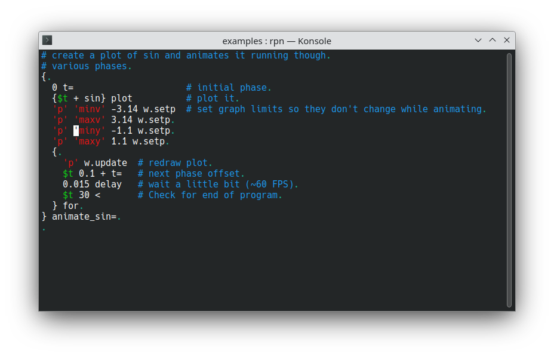

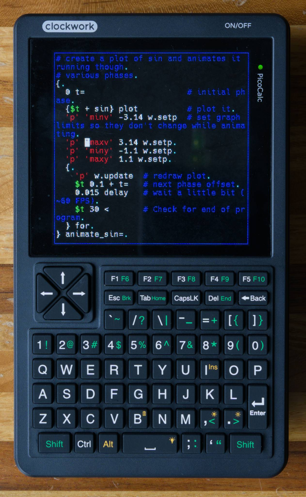

The editor only supports basic features right now:

- arrow key, `page up`, `page down`, `home`, `end` navigation
- `ins`, `backspace`, `delete`
- syntax highlighting

While editing, press `ESC` to keep your changes (which will be
at the top of the stack) or `Ctrl-c` to exit without changing the
value.  If you happen to want to save your work permanently, exit with
`esc`, then type something like:

```
'my_file.txt' save
```

If you need more editing power, you can use a text editor on
your computer and copy over the file via serial or
an SD Card.

### Stack Shifts

You can move values around the stack.  Below, assume that the stack
from one line carries to the next line.

               # stack will contain
    10 20 30   # 10 20 30
    1>         # 10 30 20
    1<         # 10 20 30
    2>         # 20 30 10
    2<         # 10 20 30
    $2 2<      # 10 10 20 30

### Stack Deletions

Below, assume that the stack from one line carries to the next line.

                        # stack will contain
    10 20 30            # 10 20 30
    1/                  # 10 30
    0/                  # 10
    10 20 30 40 d       # <empty>
    10 20 30 40 2 del   # 10 20
    10 20 30 40 2 keep  # 30 40


### Using Variables

You can define and use variables.  Most build variants will define some
variables, such as `$pi`, on startup.

            # stack will contain
    5 a=    # <empty>
    2 $a +  # 7

Variables that start with a `.` are hidden by default in the variable window
(which we'll get to later). These often are used for special configuration
settings.

There are also special variables, `$0`, `$1`, etc, which represent values on
stack. `$0` represents the value at the top of the stack:

            # result (assume stack is empty on each line)
    5 sq    # 25
    5 $0 *  # 25

### Viewing Variables

You can use `vlist` to list all assigned variables. There is also a special
window view that can list variables that is described later.

### Variables Can Be Stacks

Variables can hold more than one value.  This was created for two
purposes:

1. Snapshot the whole stack so you can easily do whole-stack operations
   (such as sum, min, max, etc) on the same set of data
2. Push individual variables within functions to preserve their original
   value when the function exits.

Here is the demo:

```
           # x value   |  stack
   5 x<    # 5         |  <empty>
   4 x<    # 5 4       |  <empty>
   $x      # 5 4       |  4
   $$x     # 5 4       |  4 5 4
   x>      # 5         |  4 5 4 4
   x>      # <deleted> |  4 5 4 4 5
   x<<     # 4 5 4 4 5 |  <empty>
   x>>     # <deleted> |  4 5 4 4 5
   x<< x/  # <deleted> |  <empty>
```

Note that using variables as stacks can create memory pressure on microcontrollers
if it's pushed too far.

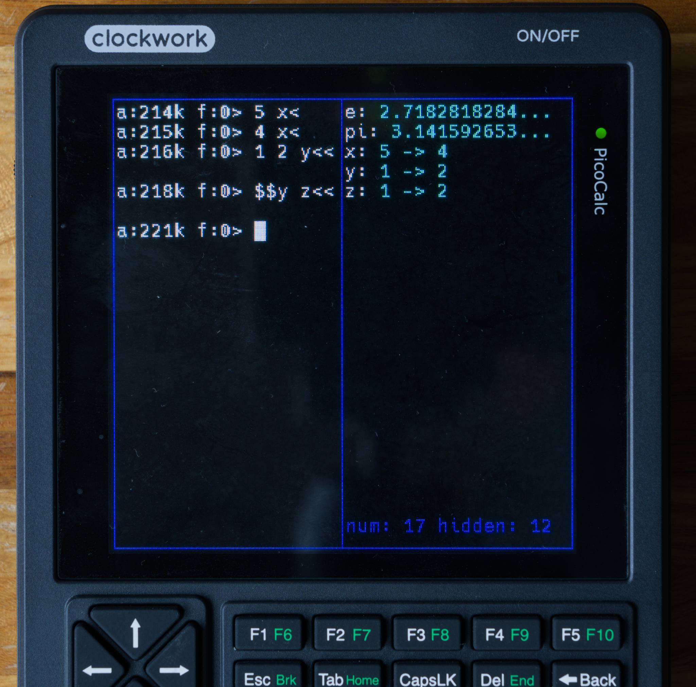

### Special variables

Variables that start with a `.` are generally considered special. Although
you can create dot variables yourself, doing so might create
unintended conflicts or confusion. The current
list of variables is briefly described here. Many of these
are covered in more detail in upcoming sections:

- `.echo` If `true` on PicoCalc, then printed output will also
  be sent to the serial port (readable by a computer).
- `.f1`, `.f2`, `.f3`... These define macros that will be executed
  when the corresponding function key is pressed
- `.init` The startup script defines this by-convention to
  contain the initilization code (located in `$HOME/.rpngo`)
- `.plotinit` If the user asks for a plot (e.g. `'sin' plot`) and
  no plot window exists, this customizable macro is used to create one.
- `.plotwin` The name of the plot window to create. This will
  usually be set to `p`.
- `.serial` The path of the serial device to use on PCs (e.g.
  `/dev/ttyACMO`).
- `.wend`, `.wtarget`, `.wweight` These can be used to control
  how a new window is created. The concept is covered later.

### Number Bases

Many type of numbers are supported

    50         # floating point (internally a 5+0i complex)
    50+i       # complex number
    50<1       # polar complex (default is radians)
    deg 50<90  # You can use degrees for the angle.
    50d        # Integer
    32x        # Hexidecimal
    62o        # octal
    110010b    # binary

Most operations can use a mix of these types, using the following rules:

    # Any number type mixed with float results in a float
    12.4 5d +  ->  17.4

    # Two integer types combined takes the base of the most left term
    32x 50d +  ->  64x

You can also convert between types using `hex`, `bin`, `oct`, `float`, `real`,
`imag`, 'polar', 'abs', 'phase', and `str`. You can convert from a string to
a type by executing it with `@`

    "54x" @  ->  54x

### Booleans and Conditionals

Boolean values include `true` and `false`.  Conditionals return a boolean:

    true       #  true
    false      #  false
    1 2 >      #  false
    1 2 <      #  true
    1 2 =      #  false
    1 2 !=     #  true
    1 2 >=     #  false
    1 2 <=     #  false
    false neg  #  true
    true neg   #  false

You can also compare different types, which is in support of `sort`:

    true 1 <       # true: booleans are always less than numbers
    1 "foo" <      # true: numbers are always less than strings
    "bar" "foo" <  # true
    1 1d =         # true: you can compare floats and integers
    1 1+i =        # false
    1+i 2 <        # true: Only the real part is compared which is
                   #       incorrect math but useful when sorting.

Conditionals are an essential part of programming, which we will cover
with examples later.

### Strings

There are three ways to specify a string

    "hello world"
    'hello world'
    {hello world}

All three examples define the same string.  The third form can be useful
when you want to nest terms in a program.

    {0 x= {$x 1 + x= $x println 1000 <} for} count=

It could also be done with other string types, rpngo will execute them
the same way:

    '0 x= "$x 1 + x= $x println 1000 <" for' count=

Which do you find easier to read?

### Macros

You can define a string as a macro, here is one for the area of a circle, given the radius:

    {sq $pi * 2 /} carea=
    5 @carea -> 39.26990817

Macros are a building block in programming, a deeper topic that is covered
later.

### Labels

Labels can be added to non string values.  A label shows up in the stack window
and can be used to annotate what the number represents.  This can be
useful when attempting to do complex calculations purely using the stack.
It cal also be used to communicate what values are (The `heapstats` function
uses this)

For example, say you want to make a formula that converts velocity, time, 
and acceleration into distance. The formula is `(v * t) + (0.5 * a * t * t)`.
You could use variables or the pure stack. If you use the pure stack, labels
can help keep track of what is what:

     1 `v
     2 `a
     3 `t

Now the stack will look like this:

     2: 1 `v
     1: 2 `a
     0: 3 `t

You can see that `$1` is `a` and see how `a` changes stack slots as you
work the equation.  This makes it easier to create a macro that does
not define any variables (which can be fun little puzzles to solve).

    {$0 sq 2> * 2 / 2< * +} dist=
    1 2 3 @dist  ->  12
   
### Unit Conversions

You can convert between several unit types, some examples:

    5 km>mi
    3.106855961

    60 mi/h>m/s
    26.8224

    10 liter>m*m*m
    0.01

    1 megabyte>bits
    8388608

See all possible conversions with

    conversions?


## Window Layout

The `rpngo` program supports several window types:

- Input
- Stack
- Variables
- Plot

Of the above, only the input is required.  For the others,
you can have zero or more of them.  For example, if you
want an input window and two separate plot windows, you
can do it. You might also have two stack windows with
different configuration options set.  Whatever you want.

For example, say we want the following:

```
+------------------+---------------+
|                  |               |
|                  |               |
|                  |               |
|   Input (i)      |  STACK (s)    |
|                  |               |
|                  |               |
+------------------+               |
|                  |               |
|                  |               |
|   Vars (v)       |               |
|                  |               |
|                  |               |
+------------------+---------------+
```

The `rpngo` window system works a bit like html tables. You have a 'root'
window that can contain children as rows or columns.
Each child can either be a window (input, stack, etc) or a window
group that can contain it's own children.  You can make a big tree
of window groups if you want, but usually just one or two is all you'll
need.

Let get on with how you would create the layout above.  First, lets reset
everything:

    w.reset

You'll have this default starting point:

```
+----------------------------------+
|                                  |
|                                  |
|                                  |
|                                  |
|                                  |
|                                  |
|         Input (i)                |
|                                  |
|                                  |
|                                  |
|                                  |
|                                  |
+----------------------------------+
```

Now lets add a window group names g

    'g' w.new.group 

and we'll have

```
+----------------------------------+
|                                  |
|                                  |
|         Input (i)                |
|                                  |
|                                  |
|                                  |
+----------------------------------+
|                                  |
|                                  |
|         Group (g)                |
|                                  |
|                                  |
+----------------------------------+
```

Let's switch the root window to column layout

    'root' w.columns

```
+----------------+------------------+
|                |                  |
|                |                  |
|                |                  |
|                |                  |
|                |                  |
|                |                  |
|   Input (i)    |    Group (g)     |
|                |                  |
|                |                  |
|                |                  |
|                |                  |
|                |                  |
+----------------+------------------+
```

and move input into the group

    'i' 'g' w.move.beg

```
+----------------------------------+
|                                  |
|                                  |
|                                  |
|                                  |
|                                  |
|                                  |
|         Input (i)                |
|         Group (g)                |
|                                  |
|                                  |
|                                  |
|                                  |
+----------------------------------+
```

Let's add the stack window:

    's' w.new.stack

```
+----------------+------------------+
|                |                  |
|                |                  |
|                |                  |
|                |                  |
|                |                  |
|                |                  |
|   Input (i)    |    Stack (s)     |
|   Group (g)    |                  |
|                |                  |
|                |                  |
|                |                  |
|                |                  |
|                |                  |
+----------------+------------------+
```

and finally the vars window. We have two options here. We can either add the vars
window to the root window, then move it to `g` or create it in `g` to begin with.
If we just say:

    $.wtarget

It will say

    'root'

We can change this "special" variable to alter the behavior of `w.new.*`
commands.  Note there is also `$.wend` and `$.wweight` for controlling placement
and size, but let's not use those yet:

    'g' .warget=
    'v' w.new.var

and we are done

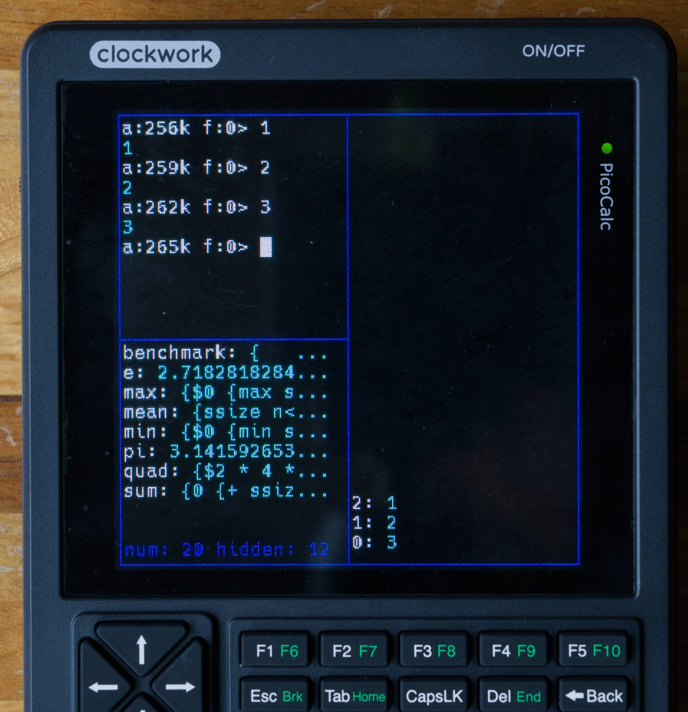

Say you want to change some sizes above.
Window and group "weights" are used to do this. Each window and group
above is assigned a default weight of `$.wweight` (usually 100)
Weights are shared amongst siblings in a group to decide how much space each one gets.

For example, ley's change the weight of window group 'g' from 100
to 200.

    'g' 200 w.weight

Things will shift as so:

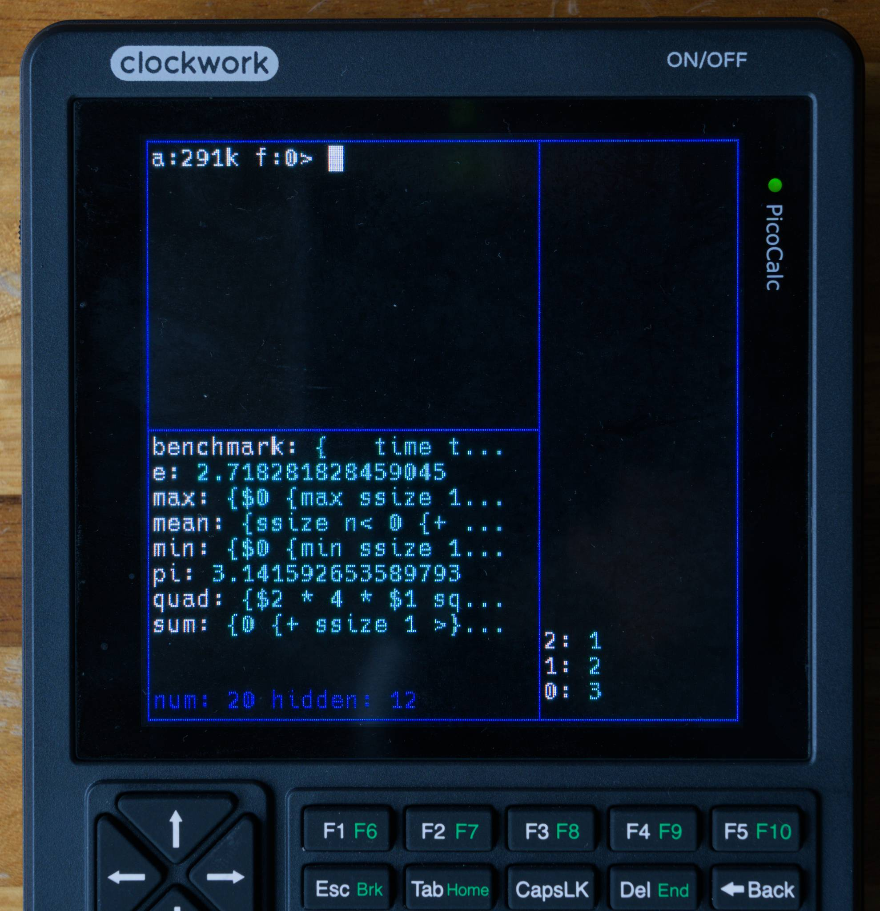

There is a command, `w.dump` that will output the current layout for
inspection. Let's try it:

    w.dump

    root(x=0, y=0, w=80, h=30, cols=true, weight=100):
      g(x=0, y=0, w=53, h=30, cols=false, weight=200):
        i(type=input, x=1, y=1, w=51, h=13, weight=100)
        v(type=var, x=1, y=15, w=51, h=14, weight=100)
      s(type=stack, x=53, y=1, w=26, h=28, weight=100)

    .wtarget=g .wend=true .wweight=100d
 
Note that `w.reset` will change `.wtarget`, `.wend`, and `.wweight`
to default values thus is a good first command when building a layout.

## Programmable Function Keys

Configuring windows like above is flexible but cumbersome.  For everyday use,
there are variables like `.f1`, `.f2` that invoke when you
press the corresponding F key.  I like to set these to change window
layouts.  For example:

```
# Input and stack window
{
  w.reset
  's' w.new.stack
  's' 30 w.weight
} .f1=

# Just one big input window
{w.reset} .f2=
```

and so on.

## Window Properties

Each of the four window types (input, stack, variable, plot) have customizable
properties.  You can list properties for a window with `w.listp`

### Input Window Properties


    'i' w.listp

       autofn: {}
       autohist: true
       histpath: '/home/mattwach/.rpngo_history'
       showframes: 1d

These are what the input properties do:

- `autofn` Executes the given code before showing a prompt.  This can be used to
  track memory usage, print a custom message, update a graph, or anything you want.
- `autohist` If enabled, the history file is updated after every
   entered command. The `histl` and `hists` function can be used to
   load and save history manually.
- `histpath` Te path to load history from and save it to.  This is `$HOME/.rpngo_history`
  by default.
- `showframes` How much of the stack to print to the input window after each
  entered command.

Here is an example of setting properties:

    'i' 'showframes' 0 w.setp

This will turn off printing the stack in the input window (If you
prefer just using the dedicated stack window instead).

#### History

Command history is always enabled in memory and can be optionally saved/restored
to disk.

History is set to save automatically on PC (`autohist` is `true`). `autohist` is
`false` by default on microcontrollers because of slow write speeds and elevated
power usage.  You can change this behavior by customizing the startup file (e.g.
`$HOME/.rpngo`)

For microcontrollers, it is suggested to bind `hists` to a function key for
quick save ability.

### Stack Window Properties

    's' w.listp

      round: -1d

For now, the only property is `round` which allow you to round
floating point numbers to a given number of decimal places (-1
represents no rounding).

### Variable Window Properties

    'v' w.listp

      showdot: false
      multiline: false

- `showdot`: If true, then variable names that start with a `.` (such as
  `.wtarget`) will also be shown.
- `multiline`: If true, then string that expand multiple lines will
  consume multiple lines in the variable window.

## Plotting

Let's plot `x * x`:

    'sq' plot

We'll see this in ncurses:

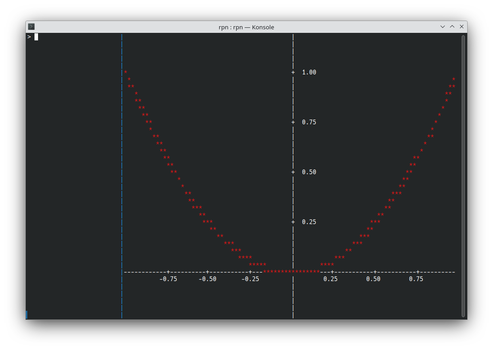

And this on an LCD display:

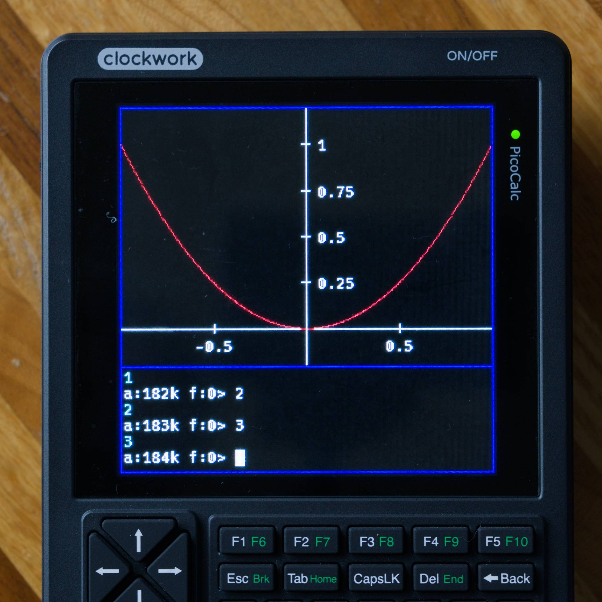

This is how `plot` works.

- A range of values is pushed to the stack (from `minv` to `maxv` with `steps`
  divisions)
  - After pushing a single value, it calls the argument to `plot`. In the example above
  that would be `sq` or "square the value"
  - After executing the plot function (`sq`), if pops the result for the stack and
    uses the value as a y-coordinate.

Let's add a second plot:

    'sin' plot


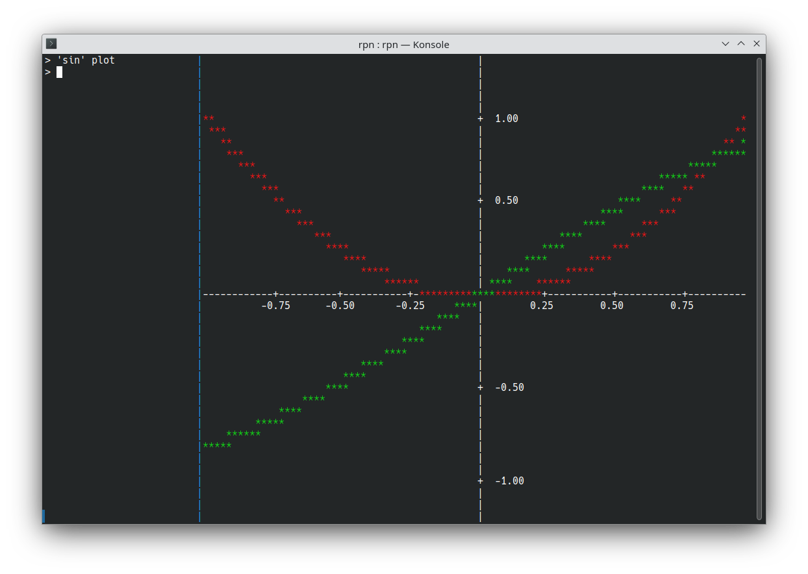

It doesn't yet look like a sine wave because the x range is currently
-1.0 to 1.0.  Let's check properties.

### Plot Properties

    'p' w.listp

      autox: true
      autoy: true
      color0: 0d
      color1: 1d
      fn0: {sq}
      fn1: {sin}
      maxv: 1
      maxx: 0.992
      maxy: 1.368294197
      minv: -1
      minx: -1
      miny: -1.209765182
      numplots: 2d
      parametric0: false
      parametric1: false
      steps: 250d

There are quite a few properties because there is quite a bit that can be
done with plots.  Let's start by updating the x range.  You might think
`minx` and `maxx` here but these are for the window and not the plot
points.  Currently we have `autox` and `autoy` set to `true` so
`minx`, `maxx`, `miny` and `maxy` will be handled automatically. To
get what we want, we adjust `minv` and `maxv`

    'p' 'minv' -3.14 w.setp
    'p' 'maxv' 3.14 w.setp

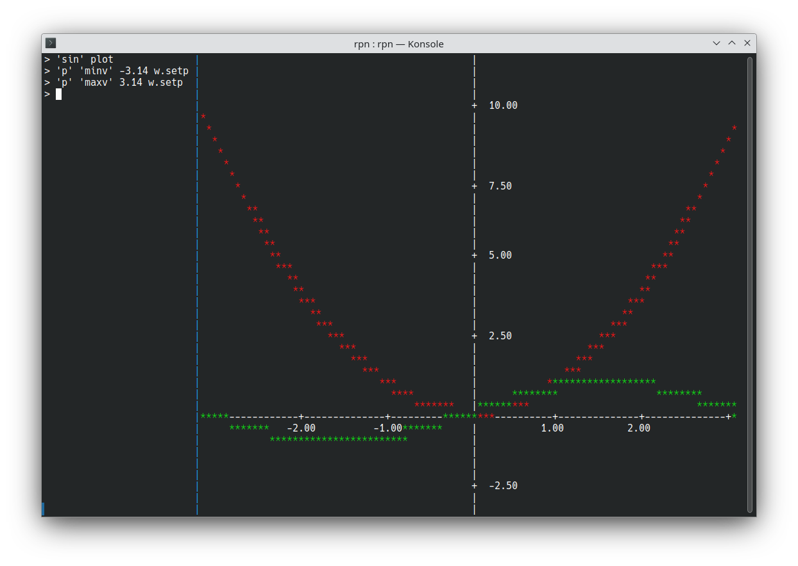

Still not ideal because the `sq` plot has a y range that is crushing the
range of `sin`. This can be addressed by setting `miny` and `maxy` manually
instead of relying on `autoy`:

    'p' 'miny' -1.1 w.setp
    'p' 'maxy' 2 w.setp


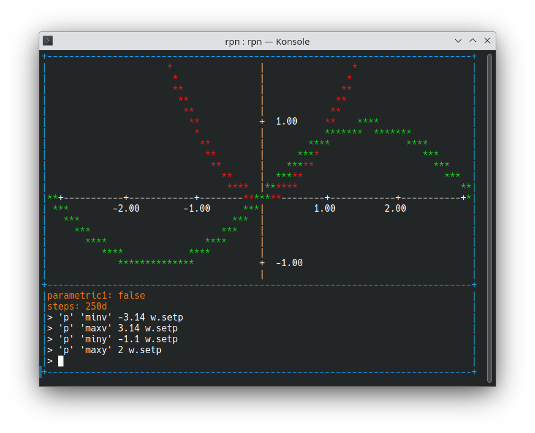

To end the demo, we'll add a parametric plot
of a circle.  For parametric plots, we don't just leave `y` on the
stack but instead leave both `x` and `y`.  Lets draw a circle,
who's parametric equation is `x = cos t, y = sin y`:

    {$0 cos 1> sin} pplot

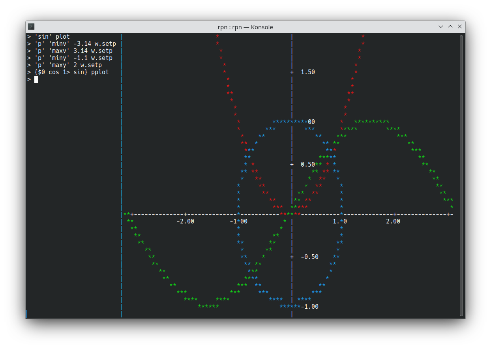

and on an LCD build:


Let's see how properties changed:

    'p' w.listp

      autox: true
      autoy: false
      color0: 0d
      color1: 1d
      color2: 2d
      fn0: {sq}
      fn1: {sin}
      fn2: {$0 cos 1> sin}
      maxv: 3.14
      maxx: 3.14
      maxy: 2
      minv: -3.14
      minx: -3.14
      miny: -1.1
      numplots: 3d
      parametric0: false
      parametric1: false
      parametric2: true
      steps: 250d

Now we can look at each property. All can be changed with `w.setp`:

- `autox`: If true, the x limits of the plot window are handled automatically
- `autoy`: Just like `autox` by for the vertical range
- `color*`: The color index of each plot. If you want to make plots a specific
  color, you can set these
- `fn*`: Plot functions. You can set these to change the plotted function. You
  can set to an empty string to nullify a plot.
- `minv`, `maxv`, `steps`: Determines the range of points that will be sent to each plot.
- `minx`, `miny`, `maxx`, `maxy`: The area the plot window covers.  If these are
  set, the corresponding `autox` or `autoy` will be set to `false` (and can be reset
  to `true` later if you want).
- `numplots`: Indicates how many plots there are. This can be set to change the
  number of plots.  Decreasing it will remove the higher-indexed plots.  Increasing
  it will create null-valued plots that can be configured with additional `w.setp` calls.
- `parameteric*`: Determines if the plot is parametric (needs to push x and y) or not
  (just needs to push y)

Now that we covered all of the properties, it can be revealed that `plot` and `pplot`
are simply setting these properties "behind the scenes". You can do so manually,
if you want.  Here, we plot `sin` and `cos` using the low-level `w.setp` method:

    # manually create a window
    w.reset
    false .wend=
    'p' w.new.plot
    'p' 300 w.weight

    # make the plot
    'p' 'numplots' 1 w.setp
    'p' 'fn0' 'sin' w.setp
    'p' 'minv' 0 w.setp
    'p' 'maxv' 20 w.setp

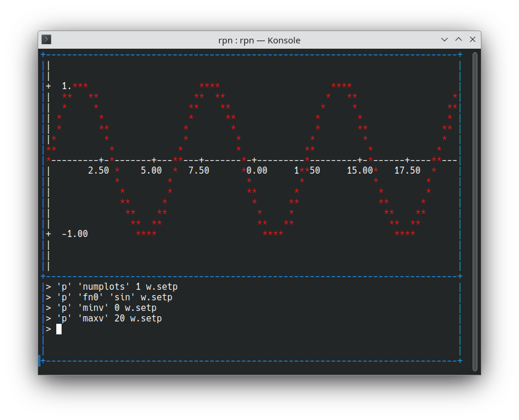

### Special Plot Variables

- `$.plotwin` The name of the plot window, usually set to `p`
- `$.plotinit` A macro that `plot` and `pplot` will execute if there
  is no `$.plotwin` window present. It is expected that one will
  exist after `@.plotinit` is executed. This is a variable to allow
  you to control the automated plot creation process.
- `$.t0` This variable is set to `true` when the very first plot point
  is calculated and `false` otherwise. Some plot functions, especially
  those that use variables, might need this information.


## File Operations

> File operations work well on PC platforms but are still experimental in
TinyGO.  This is possibly due to the current (11/2025)
[instability](https://github.com/tinygo-org/tinygo/issues/3460) of the [`tinyfs`
library](https://github.com/tinygo-org/tinyfs).

- PC: Seems to always work
- tinygo + internal flash + littlefs: Seems to work but not stress tested.  Loading new firmware
  will require a reformat.
- tinygo + sdcard + fatfs: Fails to access the card after a few operations

### Format

When using `littlefs` in tinygo, you must use the `format` command to
initialize the internal flash memory before it will allow storing files:

    'YES' format

The `YES` argument is intended to resist accidently running the command.


### Shell commands

Use the `sh` command to perform shell operations:

    'ls' sh

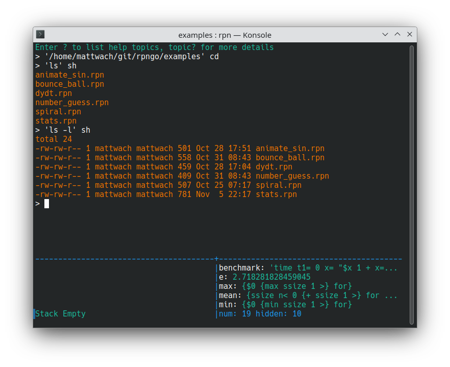

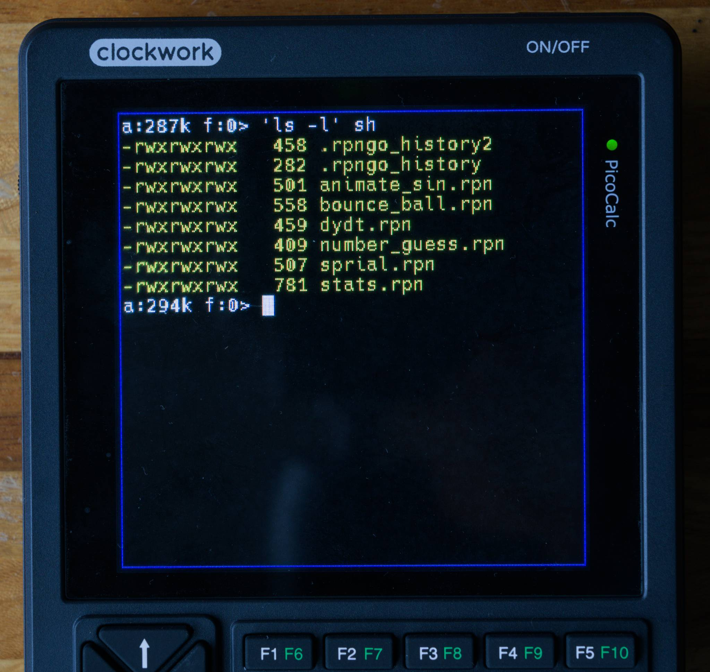

On PCs, you can call any shell command. In TinyGo, only a small set of commands
(`cat`, `cp`, `ls`, `mv`, `rm`, `pwd`) have been implemented.

There are also special variables that can be set to support
various shell usecases:

    # Set $.stdin to pass data to a process stdin
    'apple\npear\norange\ngrape' .stdin=
    'sort' sh

      apple
      grape
      orange
      pear

    # Push the command output to the stack (.stdin is still set)
    true .stdout=
    'sort' sh fields  # the stack will contain ['apple', 'grape', 'orange', 'pear']
    

### Load, Save, Execute

    'foo' cd  # change directory to foo

    'animate_sin.rpn' load @  # load a program and execute it
    'animate_sin.rpn' source  # same thing
    'animate_sin.rpn' .       # same thing

    'hello world' 'hello.txt' save  # save "hello world" to a file

## Serial communications between PC and PicoCalc

Serial is always enabled in the PicoCalc and ili9341 builds.
If the code produces log messages or a panic, it will be written
there.  

The result of commands that print to the input window
will also be sent to the serial port by default.  You can control
if the Pico sends you characters by setting the `.echo` variable to `true`
or anything else (including deleted), to disable the printing.

You can change startup behavior by editing `startup/lcd320.go` or
`.rpngo` in flash storage.

You can use `tinygo monitor`, `screen`, `minicom`
or some other serial communications software to send and
receive information from the PicoCalc using it's USB-C interface.

Note that, due to limitations of the PicoCalc UART (which is a RP2040/RP2350
UART connected to the STM32 helper chip), TinyGo, and the limitations of LCD
screen updates, block transfers to the PicoCalc have been observed to drop data,
it is suggested that the XMODEM protocol (described next) be used to send files.

### XMODEM send and receive

What is old is new.  It's possible to send and receive data from rpngo on
microcontrollers using the XMODEM protocol.  XMODEM was chosen because the
PicoCalc UART via TinyGo loses bytes now and then and XMODEM is the least
complicated widely-supported way to get around that problem.

#### Send a file to RPNGO using sx

You can, in theory, use any PC program that supports XMODEM-CRC (128 byte
packets, 16-bit CRC).  I actually tested it with `screen` and `sx`.  First,
installation:

    sudo apt install screen lrzsz

Then start screen with the following option:

    screen /dev/ttyUSB0 115200

I'm assuming the serial device on my PC and yours will be the same, which could
be incorrect. You can verify it is correcy by typing a few characters into
the screen window and see if they appear on the calculator.

Let's assume for this example that you want to send a file named
`bounce_ball.rpn`.  In `screen`, type `Ctrl-A`, `:` and type this at the prompt:

    exec !! sx bounce_ball.rpn

and on the calculator:

    rx

If everyting worked, you will have the contents of the file as a string
at the top of the stack.

#### Receive a file from RPNGO using rx

The directions here are the same as the previous section, but you type this
in the calculator first:

    sx

An then, in `screen`:

    exec !! rx -c myfile.rpn

The `-c` option indicates 16-bit CRC which is the only protocol RPNGO
supports.

#### Send and receive from another RPNGO instance

Sending from one calculator to another should is possible
by using `sx` on one and `rx` on the other. To get it to work
between PC and a microcontroller, you'll want to confirm that
the `$.serial` variable is set correctly on the PC. You'll
also want to use the `stty` command (if using linux) to
confirm that your baud rate is set correctly.

Microcontroller to microcontroller should also be possible
using baseline UART (USB to USB is not so easy because
there is no USB host mode support). Doing so will require
that the serial port be configured correctly in `main.go`
on both devices (e.g. this is a bit more advanced than other
options).

#### Send multiple files

The usual way to send multiple files is using YMODEM or ZMODEM but
RPNGO does not have them implemented at the time of writing.

There is, however a shell script that will allow you to send
multiple files in the `examples/` directory named `make_xmodem_file.sh`:

You can run it like this:

    ./make_xmodem_file.sh *.rpn > out.txt

Where `*.rpn` is the list of files you want to send.  This creates
a "program" that defines each file and saves it.  Thus you send the
`out.txt` file to the calculator, then receive and execute it:

    rx
    @

and it will create a set of files, just like YMODEM would (check with
`'ls -l' sh`). Note that you need to have working/formatted storage
for this to work (see the "Format" section above).

## The startup file

On PC, A file named `$HOME/.rpngo` will be created if it does not yet exist
using the data files in the `startup/` source folder.  You can edit this file in
order to customize the calculator at startup. Here are some thing you might want
to configure:

- The default window layout
- How to create the plot window
- Varables and macros that you always want available
- F1-F12 key bindings
- How command history is saved
- Actions to perform on every command entered
- Serial port echo (on microcontrollers)

If you delete or rename the file, a new one with default properties will
be created.

On the PicoCalc, you can hold down the `ctrl` key while powering on caclulator
to skp th startup script (safe mode).

On microcontrollers, this file is placed in the root directory.  I using the
default `littlefs` internal flash configuration, you must format this
area after loading firmware with `"YES" format` or the `.rpngo` file will
not save and you will get the default one defined in `startup/lcd320.go`. 

## Programming

RPNGO provides support for simple programming. It's not going to compete with
your favorite programming language for general work, but will allow
you to customize the calculator and mold it's functionality to meet
your usecase.

First, the building blocks:

## Conditionals

`if` and `ifelse` can be used to conditionally execute a bit of code
based on the result of a `true`/`false` condition.

```
> true {'yes' printlnx} if
yes

> false {'yes' printlnx} if

> 5 1 > {'is greater' printlnx} if
is greater

> true {'yes'} {'no'} ifelse printlnx
yes

> false {'yes'} {'no'} ifelse printlnx
no
```

## For Loop

You can use the `for` command to loop until a condition returns false.
Let's start with some impractical examples:

    {false} for  # exits immediately
    {true} for   # loops until you press ctrl-c to break

Now for something more interesting, how about counting to 1000?

    0 x= {$x 1 + println x= $x 1000 <} for

Note that it's the last three statements (`$x 1000 <`) that
is creating the `true` / `false` boolean that `for` uses
to decide when to end.

A simple tweak let's us load up the stack with numbers.

    0 x= {$x $x 1 + x= $x 100 <} for 

## Filtering

Filtering is a convenience command that allows some kind of for
loops to be written with less code - particularity ones that work
with multiple stack values.

As an example, say you want to multiply every value on the stack by 2.
A for loop can be used:

    {{2 * vals< ssize 0 >} for vals>> reverse} double=
    1 2 3 @double  # results in 2 4 6 on the stack

We can also use `filter`, which manages some of the work for us

    {{2 *} filter} double=

The `filter` command does this:

1. Takes each value on the stack and
  - Copies to it the top of the stack
  - Calls the provided filter argument.
2. Removes the original stack values

In addition to transforming every value, the `filter` command can filter values:

    {$0 50 >= {0/} if} filter  # remove numbers >= 50

Note that `del`, `keep` and variable pushes (e.g. `x<<`, `x>>`) can be combined
to filter a subset of values:

    st== $$st            # snapshot stack into $st
    5 keep {2 *} filter  # filter 5 values
    doubled<<            # store those
    st>> 5 del           # restore stack, remove 5 values
    doubled>>            # sub in doubled values

This can be applied to other functions (`sort`, `reverse`, etc) as well and
has endless possible tweaks (for example, use a variable instead of a
hard-coded 5)

## Sorting

The sort command will sort every value on the stack

    2 10 5 6 3 sort  # 2 3 5 6 10

Note that, when you sort different types, the convention-based comparison rules
are followed (strings > numbers > boolean):

    5d 10 4d 3 'foo' 'bar' true false sort  # false true 3 4d 5d 10 'bar' 'foo'

## Reverse

Reverse a stack with `reverse`

    1 2 3 4 reverse  # is now 4 3 2 1


## Trapping and creating errors

Sometimes yo want to try a command and not have the program stop if there
is an error.  The command for this is `try`:

    { @do_something } { @handle_the_error } try

The statement above will execute `@do_something`.  If there is an error then
the error will be pushed in the stack (as a string) and `@handle_the_error` will
be called.

You can also create your own errors like this:

    'my error message' error

This can be used when handling `try` errors to rethrow the same error or some
modified version of it.


### Other Programming Notes

Some of this is covered in other sections of the guide, but it's here
to make you aware in case you have not read it all.

- `@`: Executes the head element (usually a string).  e.g. `{2 2 +} @`.
  Note that `$foo @` has the same result as `@foo`.
- `print`, `println`, `printx`, `printlnx`:  Prints the head of the stack
  The `x` versions also remove the stack element.
- `prints`, `printsx`: Prints with a space after
- `load`, `save`: Loads and saves values to disk
- `.`, `source`: The same as `load @`.
- `noop`: Does nothing. This is sometimes useful as a placeholder.
- `delay`: Delays for the given number of seconds (which can be a floating
  point number like `0.1`). Delays are useful when animating graphs.
- `time`: Prints a relative time in floating point seconds. This is useful
  when benchmarking (take a `t0`, do your operation, then do `time $t0 -`).
- `edit`: A simple editor for multiline strings.
- `rand`: Create a random value from 0 to 1
- `input`: Waits for the user to enter input, pushes it to the stack as a
  string.

## Example Programs

### Number Guess

```
{
  rand 101 * int a=  # set a to a random number
  $guess_fn for     # loop until the user guesses correctly
  {
    "enter a number from 0-100: " printx input int g=
    # The next 3 lines put one message on the stack
    $g $a < {"too low"} if
    $g $a > {"too high"} if
    $g $a = {"correct!"} if
    printlnx # print the message
    $g $a != # loop conditional
  } for
} number_guess=
```

Run it with

    @number_guess

- First we come up with a random number from 0-100 and store
  it in `a`.  Don't worry about the user seeing the number
  because the variable window will not update until the program
  has finished (as we are not calling `'v' w.update` anywhere).
- Next is a loop which asks the user for a guess, then uses three
  `if` statements to feedback a message.  Finally, a check
  to see if the `for` loop should exit.


### Animated Plot

Here is an example that will animate a `sin` wave:

```
# create a plot of sin and animates it running though
# various phases
{
  0 t=                     # initial phase
  {$t + sin} plot          # plot it
  'p' 'minv' -3.14 w.setp  # set graph limits so they don't change while animating
  'p' 'maxv' 3.14 w.setp
  'p' 'miny' -1.1 w.setp
  'p' 'maxy' 1.1 w.setp
  {
    'p' w.update  # redraw plot
    $t 0.1 + t=   # next phase offset
    0.015 delay   # wait a little bit (~60 FPS)
    $t 30 <       # Check for end of program
  } for
} animate_sin=
```

Run it with `@animate_sin`

Most of it should be familiar.  Here are the new bits:

```
0 t=
{$t + sin} plot
```

Here we are using a `$t` variable to change the phase of the sin wave.

    'p' w.update

Just changing `$t` does not necessarily update the plot window, the
`w.update` command ensures that it happens.

    0.015 delay

On a PC, the script above will complete in a fraction of a second unless
we slow down the loop with a delay (here we delay for 15ms per frame).

### Bouncing Ball

Understand "Animated Plot" before going here.

```
{rand 0.5 - 0.02 *} randvel=
{
  @randvel xv=
  @randvel yv=
  0d i=
  0 x=
  0 y=
  0.05 diameter=
  {$0 cos $diameter * $x + 1> sin $diameter * $y +} pplot
  'p' 'minv' 0 w.setp
  'p' 'maxv' $pi 2 * w.setp
  'p' 'minx' -1 w.setp
  'p' 'maxx' 1 w.setp
  'p' 'miny' -1 w.setp
  'p' 'maxy' 1 w.setp
  'p' 'steps' 30 w.setp
  {@next_frame $i 1 + i= $i 1000 <} for
  'p' w.del
} bounce_ball=

{
  $x $xv +
  $0 abs 1 > {$xv neg xv= $xv + x=} {x=} ifelse

  $y $yv +
  $0 abs 1 > {$yv neg yv= $yv + y=} {y=} ifelse

  'p' w.update
  1 60 / delay
} next_frame=
```

Three functions:

- `randvel`: Creates a random velocity from -0.02 to 0.02.
- `bounce_ball`: Similar to the animated sin example, but draws a ball at
  `$x`, `$y`
- `next_frame`: A helper that updates `$x` and `$y` and handles bouncing off
  the edges of the graph areas.

### Numerical Derivative Plot (dy/dx):

```
{
  'p' 'maxv' w.getp 'p' 'minv' w.getp - 'p' 'steps' w.getp / dx=
  'p' 'minv' w.getp $dx - @dydx.fn yprev=
} init=

{
  dydx.fn=
  {
    $.t0 $init if
    @dydx.fn
    $0 $yprev -
    1> yprev=
    $dx /
  } plot
} dydx=
```

Try it with

    'sq' plot
    'sq' @dydx

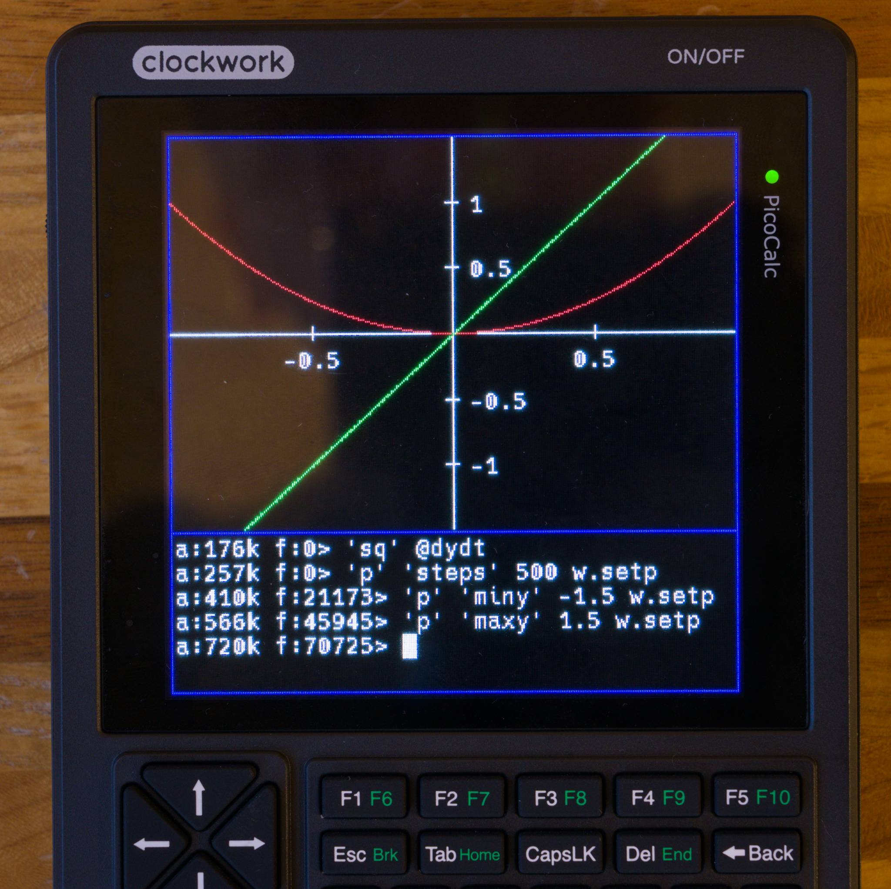

- Snapshot the argument into `$dydx.fn` so we can call it multiple
  times later.
- Calculate `dx` by looking at plot limits and steps.
- An initial `yprev` needs to be calculated to allow the first point
  to be calculated
- The plot function looks at `$t0` which is true when the first plot
  is presented (this is a feature of the calculator). It needs this
  information to calcuate `dx` and the initial `yprev` above.
- Execute `@dydx.fn` to get the value.
- Use `$yprev` to calculate `dy` and divide by `$dx`. That's our plot point.

### A Set of Statistics

```
    {0 {+ ssize 1 >} for `sum} sum=
```

```
    {ssize n< @sum n> / `mean} mean=
```

```
    {
      ssize sn<
      svals==
      $$svals @mean smean<
      svals>> {$smean - sq} filter
      @sum
      sn> / sqrt
      `stddev
      smean/
    } stddev=
```

```
    {$0 {min ssize 1 >} for `min} min=
    {$0 {max ssize 1 >} for `max} max=
```

```
    {
      int p<
      sort reverse
      ssize $p * 100d / float '>' + @
      1 keep
      "`" p> float 'th-percent' + + @
    } percent=

    {50 @percent `median} median=
```

```
    {
      vals==
      $$vals @sum statv<
      $$vals @min statv<
      $$vals @max statv<
      $$vals 10 @percent statv<
      $$vals @median statv<
      $$vals 90 @percent statv<
      $$vals @mean statv<
      $$vals @stddev statv<
      vals>>
      statv>>
    } stats=
```

There are a number of different functions above that separately calculate
`sum`, `min`, `max`, `mean`, `stddev`, `10th percentile`, `median`, `90th percentile`,
and finally one wrap-up function called `stats` that calculates all of the above
on a given set of numbers.  Try to understand them individually.

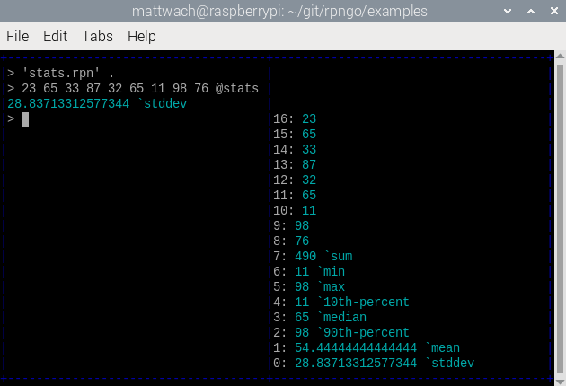
